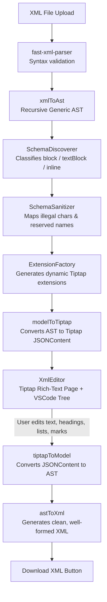

# XML Author — Dynamic Document Authoring Engine

A production-grade, client-side dynamic XML authoring web application built with **React, TypeScript, Vite, Tiptap, and fast-xml-parser**.

Runs entirely in the browser with **no backend required**. It allows users to upload **any valid XML file** (regardless of schema, tag names, or nesting depth), renders it as an executive **Microsoft Word / Google Docs-style paper canvas**, displays a **VS Code-style collapsible hierarchy tree**, and supports rich document authoring with **100% round-trip XML fidelity**.

---

## 🚀 Key Features

### 1. Dynamic Auto-Schema Discovery (Zero Hardcoding)
- **Arbitrary Tag Support**: Load any XML schema without predefined JSON schemas or DTDs.
- **Context Inference**: Automatically infers whether tags act as structural blocks, text containers, or inline elements based on document context.
- **Name Sanitization**: Automatically handles invalid ProseMirror identifier characters (such as hyphens `-` or colons `:`) and reserved primitives (`text`, `doc`, `paragraph`), mapping them safely while maintaining original tag names for export.

### 2. VS Code-Style Dual Panel Layout
- **Document Explorer (Left Sidebar)**:
  - Collapsible tree view showing the XML tag hierarchy.
  - Depth-based color coding (Teal, Purple, Green, Peach).
  - XML attribute badges (`@count`) with hover tooltips showing raw attributes.
  - Real-time text previews for leaf nodes.
  - Drag-to-resize handle (min 160px, max 500px) and a `⟨` / `⟩` collapse toggle.
- **Status Bar (Bottom)**:
  - Displays document filename, total node count, discovered tag types count, and system status.

### 3. Word & Google Docs-Style Document View
- **Paper Canvas**: Centered A4-style paper sheet with elevation shadows and page margins on a desktop backdrop.
- **Clean Semantic Typography**:
  - No raw dashed wireframes or `<tag>` prefixes cluttering the reading view.
  - Titles & Headings render as clean typographical headers.
  - Metadata blocks (`<metadata>`, `<info>`, `<front-matter>`) render as sleek property summary cards.
  - Alert callouts (`<warning>`, `<note>`, `<caution>`, `<tip>`) render as colored callout banners.
  - Code containers (`<code>`, `<example>`) render in monospace syntax blocks.

### 4. Word-Processor Authoring Tools
- **Style Selector Dropdown**: Transform any line or block into `Normal Text`, `Heading 1`, `Heading 2`, or `Heading 3`.
- **Lists with Full Keyboard Lifecycle**:
  - **`• List` (Bulleted List)** & **`1. List` (Numbered List)**.
  - Hitting <kbd>Enter</kbd> at the end of a bullet automatically creates the next bullet.
  - Hitting <kbd>Enter</kbd> or <kbd>Backspace</kbd> on an empty bullet exits the list.
- **Rich Text Formatting**: **Bold** (<kbd>Ctrl+B</kbd>), *Italic* (<kbd>Ctrl+I</kbd>), <u>Underline</u> (<kbd>Ctrl+U</kbd>).
- **Link Insertion & Navigation**:
  - Smart Link Dialog supporting URL, Display Text, and Link removal.
  - **<kbd>Ctrl</kbd> + Click** immediately opens the target link in a new tab.
  - Normal click places the cursor inside the link text for easy inline editing.

### 5. Resilient Architecture & Error Boundary
- Built-in `EditorErrorBoundary` catches any schema or rendering exceptions and displays friendly diagnostic recovery cards instead of a blank screen.

---

## 📐 Data Flow & Architecture

The application enforces a strict unidirectional pipeline with the **Generic AST** as the single source of truth:



### Architectural Constraints
- **Parser Layer (`src/xml/parser/`)**: Syntax only via `fast-xml-parser`. Never imports editor or state logic.
- **AST Layer (`src/document-model/`)**: Framework-agnostic recursive node definitions (`XmlElement`, `XmlText`).
- **Schema Layer (`src/editor/schema/`)**: Dynamic discovery and sanitization layer that shields ProseMirror from illegal names.
- **Extension Layer (`src/editor/extensions/`)**: Dynamically manufactures ProseMirror node specs and combines them with standard Tiptap extensions.
- **Adapters (`model-to-tiptap/` & `tiptap-to-model/`)**: Isolate Tiptap JSON schema details from the canonical XML AST.

---

## 📁 Project Structure

```
xml_author/
├── sample/                             # Diverse sample XMLs for testing
│   ├── api-reference.xml               # REST API documentation
│   ├── book-technical.xml              # 5-level nested book with sections
│   ├── hr-policy.xml                   # Legal policy document
│   ├── research-paper.xml              # Academic paper with citations & abstract
│   ├── training-course.xml             # Educational curriculum with modules & labs
│   └── user-manual.xml                 # Camera user manual with controls & steps
├── src/
│   ├── components/
│   │   ├── DocumentTree/               # VS Code-style collapsible hierarchy tree
│   │   ├── Editor/                     # Tiptap paper canvas editor wrapper
│   │   ├── ErrorBoundary/              # Editor error boundary with friendly fallback
│   │   ├── Export/                     # XML download button
│   │   ├── FileUpload/                 # XML file reader & pipeline driver
│   │   ├── StatusBar/                  # Bottom metrics & document info bar
│   │   ├── Toolbar/                    # Word-like ribbon (styles, formatting, lists, link)
│   │   └── ValidationError/            # Parse error banner
│   ├── document-model/
│   │   └── GenericAst.ts               # Universal recursive AST interfaces
│   ├── editor/
│   │   ├── extensions/
│   │   │   └── ExtensionFactory.ts     # Dynamic ProseMirror node generator
│   │   ├── model-to-tiptap/            # AST → Tiptap JSONContent adapter
│   │   ├── schema/
│   │   │   ├── SchemaDiscoverer.ts     # Structural tag classifier
│   │   │   └── SchemaSanitizer.ts      # Name cleaning & bidirectional mapping
│   │   └── tiptap-to-model/            # Tiptap JSONContent → AST adapter
│   ├── hooks/
│   │   └── useSidebarResize.ts         # Sidebar drag-to-resize & collapse hook
│   ├── state/
│   │   └── useDocumentState.ts         # Global document state
│   ├── xml/
│   │   ├── model-to-xml/               # AST → XML string serializer
│   │   ├── parser/                     # fast-xml-parser wrapper
│   │   └── xml-to-model/               # Parsed objects → Generic AST
│   ├── App.tsx                         # Main app shell & panel layout
│   ├── index.css                       # Catppuccin / Google Docs paper styling
│   └── main.tsx                        # Entry point
├── package.json
├── tsconfig.json
└── vite.config.ts
```

---

## 🛠️ Getting Started

### Prerequisites
- [Node.js](https://nodejs.org/) (version 18+ recommended)
- `npm`

### Installation
```bash
git clone https://github.com/sankha4567/xml_authoring.git
cd xml_authoring
npm install
```

### Development Server
```bash
npm run dev
```
Open [http://localhost:5173](http://localhost:5173) in your browser.

### Production Build
```bash
npm run build
```
Creates an optimized production bundle in `dist/`.

---

## 🧪 Testing with Sample Files

Try uploading the files located in the [`sample/`](sample/) directory:

| Sample File | Primary Tags | Key Characteristic |
|---|---|---|
| `book-technical.xml` | `book`, `chapter`, `section`, `subsection` | Deeply nested 5-level hierarchy |
| `hr-policy.xml` | `policy-document`, `clause`, `critical-warning` | Hyphenated enterprise tag names |
| `api-reference.xml` | `endpoint`, `field`, `request`, `response` | Technical specifications |
| `research-paper.xml` | `front-matter`, `abstract`, `finding`, `citation` | Academic structure with citations |
| `user-manual.xml` | `chapter`, `step`, `control`, `caution`, `problem` | Numbered steps and troubleshooting |
| `training-course.xml` | `module`, `lesson`, `topic`, `metric`, `lab` | Educational curriculum |

---

## 📄 License
MIT
